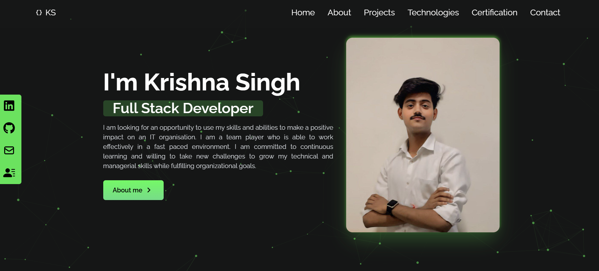
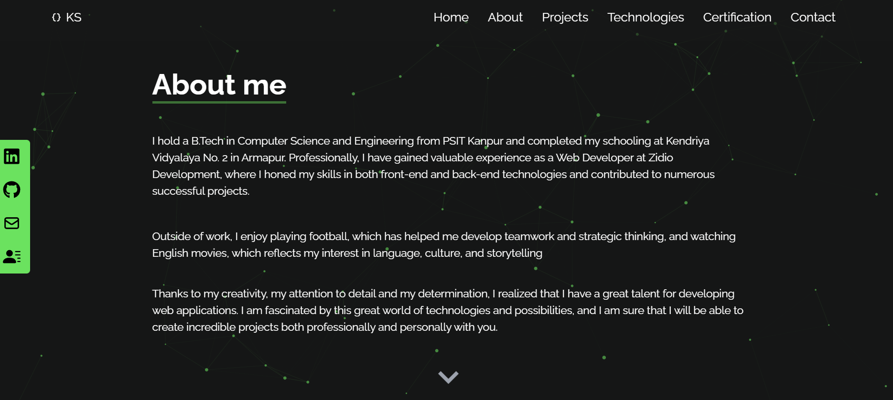
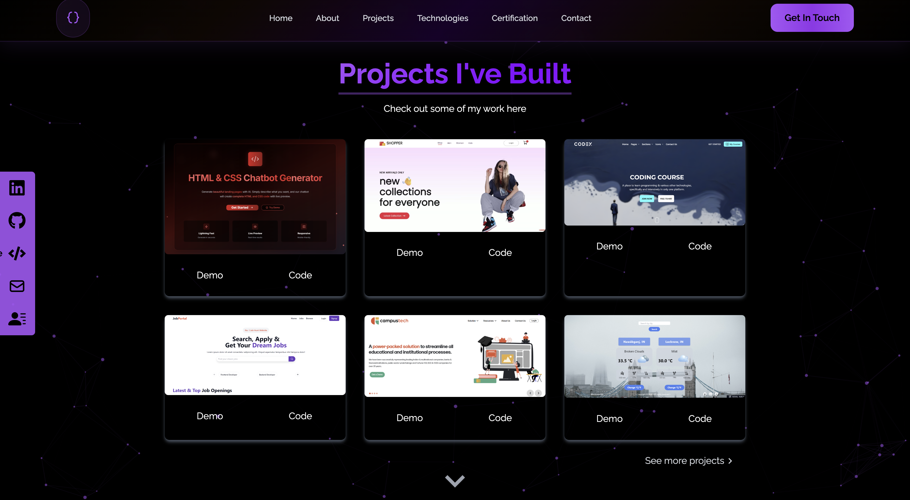
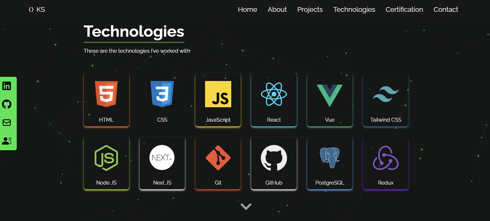
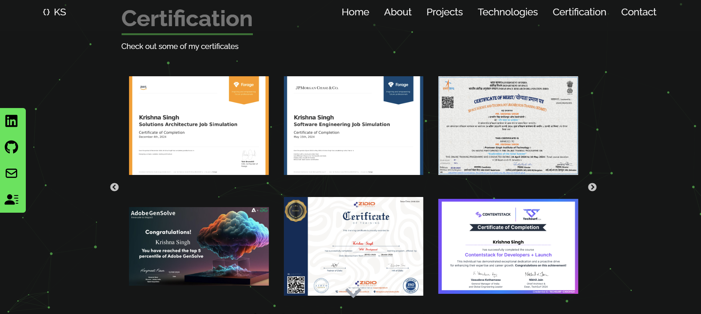

# 🚀 Krishna Singh's Portfolio

Welcome to my **personal portfolio** – a showcase of my skills, projects, and journey as a **Frontend Developer**.

🌍 **Live Demo:** [krishna-singh.netlify.app](https://krishna-singh.netlify.app/)

📌 **GitHub Repository:** [Portfolio Source Code](https://github.com/singhkrishna01/Portfolio)

---

## 🎨 About My Portfolio
This portfolio is a **modern, responsive, and interactive** web application designed to represent my **skills, experience, and projects** in an elegant way. It features smooth animations, a sleek UI, and a well-structured layout to ensure a great user experience.

## ✨ Key Highlights
- **⚡ Elegant UI & UX** – Aesthetic design with smooth transitions.
- **🖥️ Fully Responsive** – Optimized for all devices.
- **🌙 Light & Dark Mode** – Switch themes for a personalized experience.
- **📂 Projects Showcase** – Displaying my best work with live previews.
- **📜 Resume Download** – Quick access to my professional resume.
- **🏆 Certifications** – Showcasing my achievements and credentials.
- **🛠️ Technology Stack** – Highlighting my technical expertise.
- **📧 Contact Form** – Easy way to connect with me.

## 🖼️ Screenshots
### 📌 Homepage

### 📌 About Page

### 📌 Projects Page

### 📌 Technology Page

### 📌 Certifications Page



## 🛠️ Tech Stack
- **HTML, CSS, JavaScript** – Core web technologies
- **React.js** – Dynamic frontend framework
- **Bootstrap** – Responsive design and layout
- **GSAP (GreenSock Animation Platform)** – Smooth animations

## 📂 Project Structure
```
Portfolio/
│── public/
│── src/
│   ├── components/
│   │   ├── Header/
│   │   ├── Home/
│   │   │   ├── Hero.js
│   │   │   ├── Introduction.js
│   │   ├── About/
│   │   │   ├── Bio.js
│   │   │   ├── Skills.js
│   │   ├── Projects/
│   │   │   ├── ProjectList.js
│   │   │   ├── ProjectCard.js
│   │   ├── Certifications/
│   │   │   ├── CertificateList.js
│   │   ├── Technologies/
│   │   │   ├── TechStack.js
│   │   ├── Contact/
│   │   │   ├── ContactForm.js
│   │   ├── Footer/
│   │   │   ├── Footer.js
│   ├── assets/
│   ├── styles/
│   ├── App.js
│   ├── index.js
│── package.json
│── README.md
```

## 🚀 How to Run the Project
1. Clone the repository:
   ```sh
   git clone https://github.com/singhkrishna01/Portfolio.git
   ```
2. Navigate to the project folder:
   ```sh
   cd Portfolio
   ```
3. Install dependencies:
   ```sh
   npm install
   ```
4. Start the development server:
   ```sh
   npm start
   ```
5. Open your browser and visit:
   ```sh
   http://localhost:3000
   ```

## 🎯 Future Enhancements
- 🏆 **Blog Section** – Share insights and experiences.
- 💼 **Dynamic CMS** – Manage portfolio content easily.
- 📊 **Visitor Analytics** – Track engagement and interactions.

## 📞 Contact Me
📩 **Email:** krishna00csgmail.com

🔗 **Leetcode:** [Krishna2011](https://leetcode.com/u/Krishna2011/)  

🔗 **LinkedIn:** [krishnasingh20](https://www.linkedin.com/in/krishnasingh20/)  

